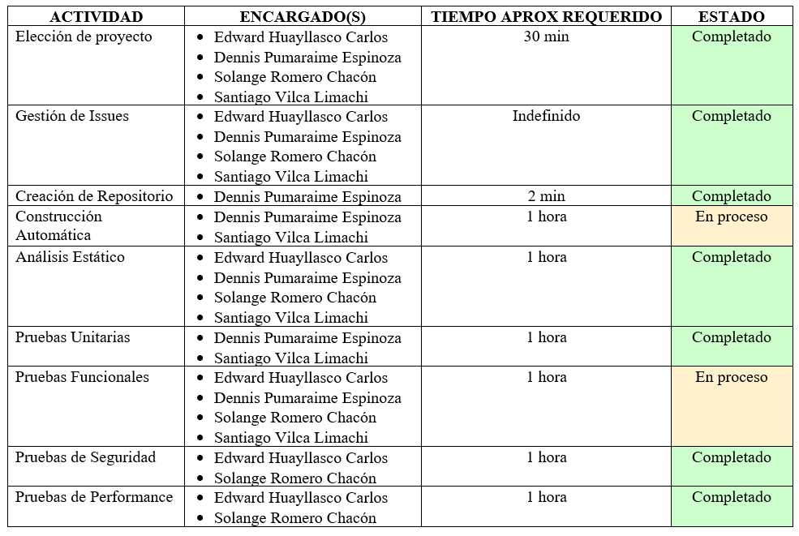
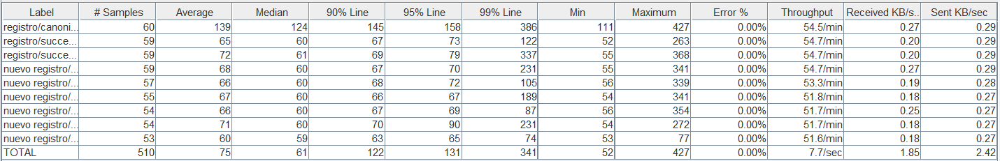

# PROYECTO FINAL - INGENIERÍA DE SOFTWARE II
### IMPLEMENTACIÓN DE UN ENTORNO DE INTEGRACIÓN CONTINUA (CI/CD)
## Integrantes
Edward Luis Huayllasco Carlos

Dennis Pumaraime Espinoza

Solange Aracely Romero Chacón

Santiago Javier Vilca Limachi

## Proyecto
[Anderson Bastidas](https://github.com/Anders87x/Tutorial_MesaDePartes) 

### Propósito
### Funcionalidades
### Arquitectura

### Plan

## Gestión de Issues
[Trello](https://trello.com/b/IEpbXa8p) 

## Análisis Estático con SONARQUBE

### Vulnerabilidad (6)

### Bugs (436)

### Code Smell (6.3k)

## Pruebas de Seguridad con OWASP ZAP

### Recuentos de alerta por riesgo y confiabilida
Esta tabla muestra el número de alertas para cada nivel de riesgo y confiabilidad incluidas en el informe. (Los porcentajes entre paréntesis representan el recuento como porcentaje del número total de alertas incluidas en el informe, redondeado a un decimal).

### Recuento de alertas por centro y riesgo
Esta tabla muestra, para cada centro en el que se han emitido una o más alertas, el número de alertas emitidas en cada nivel de riesgo. Las alertas con un nivel de confianza de "falso positivo" se han excluido de estos recuentos. (Las cifras entre paréntesis son el número de alertas emitidas para el centro en ese nivel de riesgo o por encima de él).

### Recuento de alertas por tipo de alerta
Esta tabla muestra el número de alertas de cada tipo de alerta, junto con el nivel de riesgo del tipo de alerta. (Los porcentajes entre paréntesis representan cada recuento como porcentaje, redondeado a un decimal, del número total de alertas incluidas en este informe).

## Pruebas de Performance con JMeter
Se realizo una prueba infinita para ver el rendimiento del programa, donde los resultados fueron:

En View Results Tree:

En Aggregate Report: donde vemos el numero de usuarios que testearon cada una de las pruebas y sus tiempos respectivos

En Active Threads Over Time, en este observaremos el tiempo de cada uno de los hilos(usuarios) activos.

En Response Times Over Time, en este veremos el tiempo de respuesta de cada prueba por hilo(usuario).

